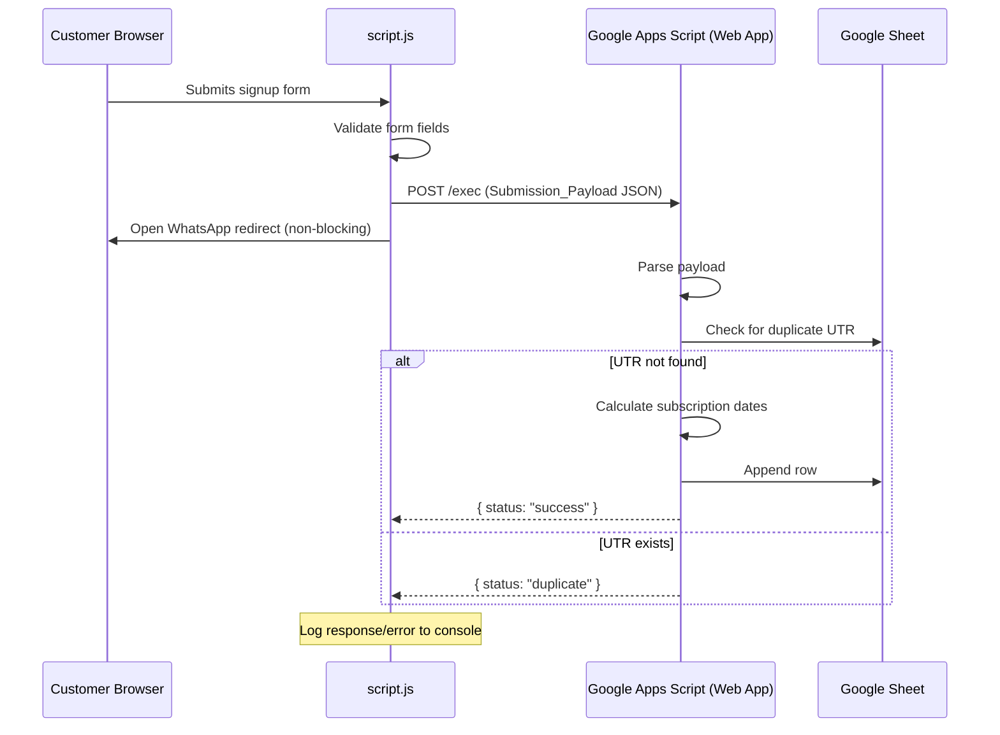

# Design Document: Google Sheets Data Storage

## Overview

This feature integrates Google Sheets as a lightweight subscription-tracking backend for the DevTools Pro landing page. The architecture uses Google Apps Script deployed as a public web app endpoint to receive form data POSTed from the client-side JavaScript. The integration is intentionally fire-and-forget on the client side — form submission and WhatsApp redirect proceed regardless of whether the data reaches the sheet.

**Key Design Decisions:**

1. **Google Apps Script as serverless backend** — No infrastructure to manage, free tier covers the volume, and it has native Google Sheets access.
2. **Fire-and-forget client pattern** — The fetch call is non-blocking. The user experience (WhatsApp redirect) is never delayed or broken by storage failures.
3. **Standard CORS handling** — Google Apps Script web apps deployed with "Anyone" access return proper CORS headers when the request follows redirects. We use a standard `fetch` with `redirect: "follow"` to be able to read the JSON response for logging.
4. **Duplicate detection via UTR** — Server-side deduplication prevents the same transaction from being recorded twice if a user re-submits.
5. **Date arithmetic on the server** — Subscription end date calculation happens in Apps Script to ensure consistency regardless of client timezone.

## Architecture



**Component Boundary:**

| Layer | Technology | Responsibility |
|-------|-----------|---------------|
| Client | Vanilla JS (script.js) | Form validation, payload construction, async POST, WhatsApp redirect |
| Server | Google Apps Script (Code.gs) | Receive POST, deduplicate, calculate dates, write to sheet |
| Storage | Google Sheets | Persistent storage of subscription records |

## Components and Interfaces

### 1. Client-Side (script.js modifications)

**New constant:**
```javascript
const GOOGLE_SHEETS_ENDPOINT = 'https://script.google.com/macros/s/<DEPLOYMENT_ID>/exec';
```

**New function — `submitToGoogleSheets(payload)`:**
- Accepts a `Submission_Payload` object
- Sends a `fetch` POST request with JSON body
- Uses `AbortController` with a 10-second timeout
- Returns a Promise (but the caller does not `await` it — fire-and-forget)
- Logs success/failure/timeout to `console.log` / `console.error`

**Modified form submit handler:**
- After validation passes and before `window.open(whatsapp...)`:
  1. Build the `Submission_Payload` object from form values + `new Date().toISOString()`
  2. Call `submitToGoogleSheets(payload)` (no `await`)
  3. Proceed immediately to WhatsApp redirect

### 2. Server-Side (Code.gs — Google Apps Script)

**`doPost(e)` function:**
- Entry point for all POST requests to the web app
- Parses `e.postData.contents` as JSON
- Calls `isDuplicate(utrId)` for deduplication
- Calls `calculateEndDate(startDate)` for subscription end date
- Calls `appendRecord(...)` to write the row
- Returns `ContentService.createTextOutput(JSON.stringify(response))` with MIME type JSON

**`isDuplicate(utrId)` function:**
- Gets all values in the UTR column (column F)
- Performs case-insensitive comparison
- Returns `true` if match found

**`calculateEndDate(startDate)` function:**
- Takes a `Date` object
- Adds one calendar month using `setMonth(month + 1)`
- Handles end-of-month overflow (e.g., Jan 31 → Feb 28)
- Returns a `Date` object

**`formatDate(date)` function:**
- Formats a Date to `DD/MM/YYYY` string

### 3. Google Sheet Structure

The target sheet (first sheet in the spreadsheet) must have these column headers in Row 1:

| Column | Header | Source |
|--------|--------|--------|
| A | Timestamp | `submissionTimestamp` from payload (ISO string) |
| B | First Name | `firstName` from payload |
| C | Last Name | `lastName` from payload |
| D | Email | `email` from payload |
| E | Selected Plan | `selectedPlan` from payload |
| F | UTR/Transaction ID | `utrId` from payload |
| G | Subscription Start Date | Derived from `submissionTimestamp` (DD/MM/YYYY) |
| H | Subscription End Date | Calculated: start + 1 month (DD/MM/YYYY) |
| I | Subscription Status | Always "Active" on insert |

## Data Models

### Submission_Payload (Client → Server)

```json
{
  "firstName": "string",
  "lastName": "string",
  "email": "string",
  "selectedPlan": "Pro | Pro+ | Pro Max | Power",
  "utrId": "string",
  "submissionTimestamp": "string (ISO 8601, e.g. 2025-01-15T10:30:00.000Z)"
}
```

### Success Response (Server → Client)

```json
{
  "status": "success",
  "message": "Record added successfully"
}
```

### Duplicate Response (Server → Client)

```json
{
  "status": "duplicate",
  "message": "UTR already exists"
}
```

### Error Response (Server → Client)

```json
{
  "status": "error",
  "message": "string describing the error"
}
```

### Subscription Date Calculation Rules

| Start Date | End Date | Rule Applied |
|-----------|----------|--------------|
| Jan 15 | Feb 15 | Normal +1 month |
| Jan 31 | Feb 28 (or 29) | Capped to last day of next month |
| Mar 31 | Apr 30 | Capped to last day of next month |
| Feb 28 | Mar 28 | Normal +1 month |

Algorithm:
1. Clone the start date
2. Set month to `month + 1`
3. If the resulting day-of-month differs from the original (overflow occurred), set day to 0 of the current month (which gives the last day of the target month)

## Correctness Properties

*A property is a characteristic or behavior that should hold true across all valid executions of a system — essentially, a formal statement about what the system should do. Properties serve as the bridge between human-readable specifications and machine-verifiable correctness guarantees.*

### Property 1: Payload construction completeness

*For any* valid set of form field values (non-empty firstName, non-empty lastName, valid email, any selectedPlan from the set {"Pro", "Pro+", "Pro Max", "Power"}, and utrId of length ≥ 6), the constructed Submission_Payload SHALL contain all six required keys (firstName, lastName, email, selectedPlan, utrId, submissionTimestamp) with non-empty string values matching the trimmed form inputs.

**Validates: Requirements 2.1**

### Property 2: Timestamp ISO 8601 round-trip

*For any* Date object representing a valid point in time, the generated submissionTimestamp string SHALL be a valid ISO 8601 date-time string that, when parsed back via `new Date(timestamp)`, produces the same millisecond value as the original Date.

**Validates: Requirements 2.2**

### Property 3: Date formatting round-trip

*For any* valid Date object, formatting it with `formatDate` to DD/MM/YYYY and then parsing the resulting components back should yield the same day, month, and year values as the original Date.

**Validates: Requirements 3.2**

### Property 4: End date calculation with month-end clamping

*For any* valid start date, the calculated Subscription End Date SHALL satisfy:
1. The end date month is exactly one month after the start date month (wrapping December → January with year increment)
2. The end date day is equal to the start date day, OR if the start date day exceeds the number of days in the target month, the end date day is the last day of the target month
3. The end date is always a valid calendar date

**Validates: Requirements 3.3, 6.1, 6.2, 6.3**

### Property 5: Duplicate detection case-insensitive correctness

*For any* UTR string `u` and any existing set of UTR strings in the sheet, the duplicate check SHALL return `true` if and only if there exists a string `e` in the existing set such that `u.toLowerCase() === e.toLowerCase()`.

**Validates: Requirements 5.1, 5.3**

## Error Handling

### Client-Side Error Handling

| Scenario | Behavior | User Impact |
|----------|----------|-------------|
| Network error (offline, DNS failure) | Catch error, `console.error(...)`, proceed with redirect | None — user sees WhatsApp as expected |
| Timeout (>10s) | AbortController aborts fetch, catch AbortError, log, proceed | None |
| Non-200 response | Log response status + body, proceed with redirect | None |
| CORS error | Caught by fetch rejection, logged, proceed | None |
| Malformed response JSON | Not parsed on client (fire-and-forget), no impact | None |

**Implementation Pattern:**
```javascript
async function submitToGoogleSheets(payload) {
  const controller = new AbortController();
  const timeoutId = setTimeout(() => controller.abort(), 10000);
  try {
    const response = await fetch(GOOGLE_SHEETS_ENDPOINT, {
      method: 'POST',
      headers: { 'Content-Type': 'application/json' },
      body: JSON.stringify(payload),
      signal: controller.signal,
    });
    if (!response.ok) {
      console.error('Sheets submission failed:', response.status);
    }
  } catch (error) {
    console.error('Sheets submission error:', error.message);
  } finally {
    clearTimeout(timeoutId);
  }
}
```

The function is called without `await` in the form submit handler — it fires and the redirect proceeds immediately.

### Server-Side Error Handling (Apps Script)

| Scenario | Behavior | Response |
|----------|----------|----------|
| Invalid/missing JSON body | Catch parse error | `{ status: "error", message: "Invalid payload" }` |
| Missing required fields | Validate before write | `{ status: "error", message: "Missing required field: <name>" }` |
| Duplicate UTR | Skip write | `{ status: "duplicate", message: "UTR already exists" }` |
| Sheet API failure | Catch exception | `{ status: "error", message: "Failed to write: <details>" }` |

All responses return HTTP 200 (Google Apps Script web apps always return 200 for doPost; the status is communicated in the JSON body).

## Testing Strategy

### Unit Tests (Example-Based)

Target: Specific scenarios and edge cases that don't need 100+ iterations.

| Test | What it verifies |
|------|-----------------|
| Submit with all 4 plan types | Correct plan name passes through (Req 2.3) |
| Successful write returns `{ status: "success" }` | Response format (Req 1.4) |
| Write failure returns `{ status: "error", message }` | Error response format (Req 1.5) |
| Duplicate UTR returns `{ status: "duplicate" }` | Duplicate skip behavior (Req 5.2) |
| Status is always "Active" on new record | Constant field (Req 3.4) |
| Fetch called before window.open | Ordering (Req 4.1) |
| Redirect proceeds on fetch failure | Resilience (Req 4.3, 7.1, 7.2) |
| AbortController timeout is 10s | Timeout config (Req 7.3) |
| Jan 31 → Feb 28 (non-leap) | Edge case (Req 6.2) |
| Jan 31 → Feb 29 (leap year) | Edge case (Req 6.2) |
| Mar 31 → Apr 30 | Edge case (Req 6.3) |

### Property-Based Tests

**Library:** [fast-check](https://github.com/dubzzz/fast-check) (JavaScript PBT library)

**Configuration:** Minimum 100 iterations per property test.

| Property | Tag | Req |
|----------|-----|-----|
| Payload construction completeness | Feature: google-sheets-data-storage, Property 1: Payload construction completeness | 2.1 |
| Timestamp ISO 8601 round-trip | Feature: google-sheets-data-storage, Property 2: Timestamp ISO 8601 round-trip | 2.2 |
| Date formatting round-trip | Feature: google-sheets-data-storage, Property 3: Date formatting round-trip | 3.2 |
| End date calculation with month-end clamping | Feature: google-sheets-data-storage, Property 4: End date calculation with month-end clamping | 3.3, 6.1, 6.2, 6.3 |
| Duplicate detection case-insensitive correctness | Feature: google-sheets-data-storage, Property 5: Duplicate detection case-insensitive correctness | 5.1, 5.3 |

### Integration Tests

| Test | What it verifies |
|------|-----------------|
| End-to-end: submit form → row appears in sheet | Full pipeline works (Req 1.3) |
| Submit duplicate UTR → no new row | Duplicate prevention in real sheet (Req 5.1) |

These require a deployed Apps Script endpoint and a test Google Sheet. Run manually or in CI with service account credentials.

### Test File Organization

```
tests/
├── unit/
│   ├── payload-builder.test.js      # Payload construction tests
│   ├── date-utils.test.js           # formatDate, calculateEndDate unit tests
│   └── submission-handler.test.js   # Client-side submit flow tests
├── property/
│   ├── payload.property.test.js     # Property 1, 2
│   ├── dates.property.test.js       # Property 3, 4
│   └── duplicates.property.test.js  # Property 5
└── integration/
    └── sheets-endpoint.integration.test.js
```
