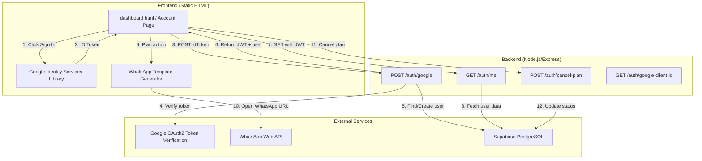

# Design Document: Google SSO Account Page

## Overview

This feature enhances the existing DevTools Pro application by integrating Google Single Sign-On (SSO) authentication with a dedicated Account Page. The Account Page enables authenticated users to view their subscription details and perform plan management actions (renew, upgrade, cancel) — each action generating a pre-filled WhatsApp message to support.

The system builds on the existing backend (`backend/auth.js`, `backend/server.js`) and frontend (`dashboard.html`) infrastructure, extending them with new endpoints, UI states, and a WhatsApp template generation utility.

### Key Design Decisions

1. **Extend existing `dashboard.html`** rather than creating a new page — the current dashboard already handles authentication state and plan display, so we enhance it with renewal/upgrade/cancel flows.
2. **WhatsApp-based plan actions** — since plan changes are processed manually by support, the system generates structured WhatsApp messages rather than implementing automated payment/plan-change logic.
3. **JWT-based sessions** with 7-day expiry — already implemented in `auth.js`, no changes needed to the token mechanism.
4. **Supabase PostgreSQL** remains the data store — the existing `users` table schema supports all required fields.
5. **Static HTML + inline JS** pattern preserved — no build tools or frameworks introduced.

## Architecture



### Request Flow

1. **Authentication**: User clicks "Sign in with Google" → Google Identity Services returns ID token → Frontend sends to `POST /auth/google` → Backend verifies with Google, finds/creates user, returns JWT.
2. **Session Validation**: On page load, frontend checks localStorage for JWT → calls `GET /auth/me` → renders dashboard or sign-in screen.
3. **Plan Actions (Renew/Upgrade)**: User clicks action button → confirmation card displayed → "Confirm via WhatsApp" opens pre-filled WhatsApp URL in new tab.
4. **Plan Cancellation**: User clicks "Cancel Plan" → confirmation modal → confirm → `POST /auth/cancel-plan` updates DB → UI refreshes to show cancelled state.

## Components and Interfaces

### Backend Components

#### 1. Auth Service (`backend/auth.js`) — Existing, Minor Enhancement

| Function | Purpose | Changes Needed |
|----------|---------|----------------|
| `verifyGoogleToken(idToken)` | Verify Google ID token via tokeninfo endpoint | None — already implemented |
| `findOrCreateUser(client, googleUser)` | Create new user or update last_login | None — already handles `plan_status: 'none'` default |
| `generateSessionToken(user)` | Generate JWT with 7-day expiry | None |
| `requireAuth(req, res, next)` | Express middleware to validate Bearer token | None |

#### 2. Server Routes (`backend/server.js`) — Existing, No New Endpoints Needed

| Endpoint | Method | Auth | Purpose |
|----------|--------|------|---------|
| `/auth/google` | POST | No | Verify Google token, return JWT + user |
| `/auth/me` | GET | JWT | Return current user profile |
| `/auth/cancel-plan` | POST | JWT | Set `plan_status` to "cancelled" |
| `/auth/google-client-id` | GET | No | Return Google Client ID for frontend |
| `/auth/update-plan` | POST | JWT | Update plan after payment (admin/system use) |

All required backend endpoints already exist. The feature work is primarily frontend.

### Frontend Components

#### 1. Account Page State Manager

Manages the page's display states based on authentication and plan data.

```
States:
  - LOADING: Spinner while fetching /auth/me
  - SIGNED_OUT: Google Sign-In button
  - SIGNED_IN_NO_PLAN: User info + "Get a Plan" CTA
  - SIGNED_IN_ACTIVE: Full plan details + Renew/Upgrade/Cancel buttons
  - SIGNED_IN_CANCELLED: Plan details with "Cancelled" badge + Renew/Upgrade
  - SIGNED_IN_EXPIRED: Plan details with "Expired" badge + Renew link
  - ERROR: Error message + retry button
```

#### 2. WhatsApp Template Generator (`whatsappTemplateGenerator`)

A JavaScript module (inline in dashboard.html) responsible for constructing pre-filled WhatsApp message URLs.

```javascript
// Interface
WhatsAppTemplateGenerator {
  generateRenewalMessage(user: UserData): string    // Returns encoded WhatsApp URL
  generateUpgradeMessage(user: UserData, newPlan: string): string
  generateCancellationMessage(user: UserData): string
  openWhatsApp(url: string): void                   // Opens URL in new tab
}
```

#### 3. Plan Action Cards

UI components for confirmation flows:

- **Renewal Confirmation Card**: Shows current plan + price + "Confirm via WhatsApp" button
- **Upgrade Selection Card**: Lists higher plans with prices + selection + "Confirm via WhatsApp"
- **Cancellation Modal**: Warning text + "Keep Plan" / "Yes, Cancel" + optional "Notify via WhatsApp"

#### 4. Plan Hierarchy Definition

```javascript
const PLAN_HIERARCHY = [
  { name: 'Pro', price: 946, priceUSD: 10 },
  { name: 'Pro+', price: 1892, priceUSD: 20 },
  { name: 'Pro Max', price: 4730, priceUSD: 50 },
  { name: 'Power', price: 9461, priceUSD: 100 }
];
```

### API Response Interfaces

#### POST /auth/google Response
```json
{
  "status": "success",
  "token": "eyJhbGciOiJIUzI1NiIs...",
  "user": {
    "id": "uuid",
    "email": "user@gmail.com",
    "name": "John Doe",
    "picture": "https://lh3.googleusercontent.com/...",
    "currentPlan": "Pro+",
    "planStatus": "active",
    "planEndDate": "2025-08-15T00:00:00.000Z"
  }
}
```

#### GET /auth/me Response
```json
{
  "status": "success",
  "user": {
    "id": "uuid",
    "email": "user@gmail.com",
    "name": "John Doe",
    "picture": "https://...",
    "currentPlan": "Pro+",
    "planStatus": "active",
    "planStartDate": "2025-07-15T00:00:00.000Z",
    "planEndDate": "2025-08-15T00:00:00.000Z",
    "utrId": "123456789012",
    "meetLink": "https://meet.google.com/xxx-yyy-zzz",
    "createdAt": "2025-07-01T00:00:00.000Z"
  }
}
```

## Data Models

### Users Table (Existing — `setup-users.sql`)

```sql
CREATE TABLE IF NOT EXISTS users (
  id UUID PRIMARY KEY DEFAULT gen_random_uuid(),
  google_id TEXT UNIQUE NOT NULL,
  email TEXT NOT NULL,
  name TEXT NOT NULL,
  picture TEXT,
  current_plan TEXT,                    -- 'Pro', 'Pro+', 'Pro Max', 'Power', or NULL
  plan_status TEXT DEFAULT 'none'       -- 'none', 'active', 'cancelled', 'expired'
    CHECK (plan_status IN ('none', 'active', 'cancelled', 'expired')),
  plan_start_date TIMESTAMPTZ,
  plan_end_date TIMESTAMPTZ,
  utr_id TEXT,
  meet_link TEXT,
  last_login TIMESTAMPTZ DEFAULT NOW(),
  created_at TIMESTAMPTZ DEFAULT NOW()
);
```

No schema changes are required. The existing table supports all needed states.

### Frontend Data Model (localStorage)

```javascript
// Stored in localStorage as 'dt_user'
UserData {
  id: string,           // UUID
  email: string,
  name: string,
  picture: string,      // Google profile picture URL
  currentPlan: string | null,
  planStatus: 'none' | 'active' | 'cancelled' | 'expired',
  planStartDate: string | null,   // ISO date
  planEndDate: string | null,     // ISO date
  utrId: string | null,
  meetLink: string | null
}
```

### WhatsApp Message Templates

| Action | Template |
|--------|----------|
| Renew | `Hi, I'd like to renew my plan.\n\nName: {name}\nEmail: {email}\nCurrent Plan: {plan}\nExpiry Date: {expiry}\n\nPlease process my renewal. Thank you!` |
| Upgrade | `Hi, I'd like to upgrade my plan.\n\nName: {name}\nEmail: {email}\nCurrent Plan: {current_plan}\nUpgrade To: {new_plan}\nExpiry Date: {expiry}\n\nPlease process my upgrade. Thank you!` |
| Cancel | `Hi, I'd like to cancel my plan.\n\nName: {name}\nEmail: {email}\nCurrent Plan: {plan}\nExpiry Date: {expiry}\n\nPlease confirm my cancellation. Thank you!` |

### Configuration Constants

```javascript
const CONFIG = {
  API_BASE: 'https://devtools-pro.onrender.com',
  WHATSAPP_NUMBER: '919019879108',
  SESSION_TOKEN_KEY: 'dt_token',
  USER_DATA_KEY: 'dt_user',
  REQUEST_TIMEOUT_MS: 10000,
  MAX_WHATSAPP_MESSAGE_LENGTH: 1000
};
```


## Correctness Properties

*A property is a characteristic or behavior that should hold true across all valid executions of a system — essentially, a formal statement about what the system should do. Properties serve as the bridge between human-readable specifications and machine-verifiable correctness guarantees.*

### Property 1: Token audience validation

*For any* Google token payload, if the payload's `aud` field matches the configured `GOOGLE_CLIENT_ID`, the verification function SHALL return `valid: true`; if the `aud` field does not match, the function SHALL return `valid: false` with an error message.

**Validates: Requirements 1.2, 1.6**

### Property 2: User record invariants on findOrCreate

*For any* Google user profile passed to `findOrCreateUser`: if the user does not exist, the created record SHALL have `plan_status` equal to `"none"`, `current_plan` equal to `null`, and `last_login` set to a recent timestamp. If the user already exists, calling `findOrCreateUser` SHALL update only `last_login` and `picture` while preserving all other fields (id, email, name, current_plan, plan_status, plan_start_date, plan_end_date, utr_id, meet_link).

**Validates: Requirements 1.3, 1.4**

### Property 3: JWT claims correctness

*For any* valid user object, the JWT returned by `generateSessionToken` SHALL decode to contain exactly the claims `userId`, `email`, and `name` matching the input user's corresponding fields, and SHALL have an expiration time 7 days from issuance.

**Validates: Requirements 1.5**

### Property 4: Expired or invalid JWT rejection

*For any* string that is not a valid JWT signed with the application's secret, or is a JWT whose expiration has passed, the `requireAuth` middleware SHALL reject the request with a 401 status and SHALL NOT invoke the next handler.

**Validates: Requirements 1.7, 1.10**

### Property 5: Plan hierarchy filtering

*For any* valid plan name in the hierarchy (Pro, Pro+, Pro Max, Power), the upgrade options function SHALL return only plans strictly ranked above the input plan. For "Power" (the highest plan), it SHALL return an empty list.

**Validates: Requirements 4.2, 4.3**

### Property 6: WhatsApp URL structural correctness

*For any* action type and user data, the WhatsApp URL generated by the template generator SHALL match the format `https://api.whatsapp.com/send?phone={supportNumber}&text={encodedMessage}` where `supportNumber` is the configured international phone number and `encodedMessage` is a valid percent-encoded string.

**Validates: Requirements 6.1**

### Property 7: WhatsApp message includes all required user fields

*For any* user data object and any action type (renewal, upgrade, cancellation), the generated WhatsApp message SHALL contain the user's full name, email address, current plan name, and plan expiration date (or "N/A" if null). If any user field is unavailable, it SHALL substitute an empty string and still produce a valid URL.

**Validates: Requirements 6.2, 6.5, 6.6, 3.4, 4.4, 5.5**

### Property 8: WhatsApp message template format correctness

*For any* user data object, the generated renewal message SHALL match the renewal template format, the upgrade message SHALL match the upgrade template format (including the target plan), and the cancellation message SHALL match the cancellation template format — with all placeholder fields correctly substituted.

**Validates: Requirements 3.5, 4.5, 5.6**

### Property 9: URL encoding round-trip

*For any* message string containing arbitrary characters (including spaces, newlines, special characters, and unicode), URL-encoding the message and then decoding it with `decodeURIComponent` SHALL produce the original message string.

**Validates: Requirements 6.3**

### Property 10: Message length constraint with field preservation

*For any* user data and action type, the total encoded message text in the WhatsApp URL SHALL NOT exceed 1000 characters. If the message would exceed this limit, the generator SHALL truncate the message body while preserving all user detail fields (name, email, plan, expiry date).

**Validates: Requirements 6.7**

## Error Handling

### Backend Error Handling

| Scenario | HTTP Status | Response | Recovery |
|----------|-------------|----------|----------|
| Missing `idToken` in request body | 400 | `{ status: "error", message: "ID token required" }` | Frontend shows validation error |
| Invalid/expired Google token | 401 | `{ status: "error", message: "Invalid Google token" }` | Frontend shows sign-in screen |
| Token audience mismatch | 401 | `{ status: "error", message: "Token not issued for this app" }` | Frontend shows sign-in screen |
| Missing/invalid JWT on protected route | 401 | `{ status: "error", message: "Authentication required" }` | Frontend clears localStorage, shows sign-in |
| Expired JWT on protected route | 401 | `{ status: "error", message: "Invalid or expired session" }` | Frontend clears localStorage, shows sign-in |
| Database failure on user creation | 500 | `{ status: "error", message: "Failed to create user" }` | Frontend shows generic error |
| Database failure on cancel-plan | 500 | `{ status: "error", message: "Failed to cancel" }` | Frontend shows error + WhatsApp support link |

### Frontend Error Handling

| Scenario | User Experience | Recovery Action |
|----------|-----------------|-----------------|
| `/auth/me` returns 401 | Clear session, show Google Sign-In | User re-authenticates |
| `/auth/me` network failure | Show cached user data if available; otherwise show error | Retry button |
| `/auth/me` timeout (>10s) | Show error with retry option | Retry button |
| Cancel plan API failure | Show error message + "Contact support via WhatsApp" | WhatsApp link |
| Google Sign-In popup blocked | Inform user to allow popups | Manual instruction |
| WhatsApp URL fails to open | Fallback: show message text for manual copy | Copy button |

### Graceful Degradation

- **Offline/Cached Fallback**: If `/auth/me` fails but cached `dt_user` exists in localStorage, display cached data with a "Data may be stale" indicator.
- **WhatsApp Fallback**: If `window.open` is blocked, display the message text in a copyable textarea.
- **Plan Data Missing**: If `plan_end_date` or `current_plan` is null when a plan action is attempted, show an informative error rather than opening a malformed WhatsApp message.

## Testing Strategy

### Property-Based Testing

**Library**: [fast-check](https://github.com/dubzzz/fast-check) (JavaScript property-based testing library)

**Configuration**: Minimum 100 iterations per property test.

**Tag Format**: `Feature: google-sso-account-page, Property {number}: {property_text}`

The following properties will be implemented as property-based tests:

| Property | Module Under Test | Generator Strategy |
|----------|-------------------|-------------------|
| P1: Token audience validation | `auth.js` — `verifyGoogleToken` (mocked fetch) | Random strings for `aud`, random valid/invalid token payloads |
| P2: User record invariants | `auth.js` — `findOrCreateUser` (mocked Supabase) | Random Google user profiles with varying fields |
| P3: JWT claims correctness | `auth.js` — `generateSessionToken` | Random user objects with uuid, email, name |
| P4: JWT rejection | `auth.js` — `requireAuth` (mocked req/res) | Random expired JWTs, random invalid strings, missing headers |
| P5: Plan hierarchy filtering | `getUpgradeOptions` utility | Random plan names from hierarchy |
| P6: URL structural correctness | WhatsApp template generator | Random user data + action types |
| P7: Required fields inclusion | WhatsApp template generator | Random user data (including nulls) + all action types |
| P8: Template format | WhatsApp template generator | Random user data + all templates |
| P9: URL encoding round-trip | `encodeURIComponent` / URL builder | Random strings with special chars, unicode, newlines |
| P10: Length constraint | WhatsApp template generator | Random user data with extremely long fields |

### Unit Tests (Example-Based)

- **Auth flow**: Verify POST `/auth/google` with valid token returns JWT + user object
- **Plan badge rendering**: Verify correct badge color/text for each plan_status value
- **Renew button visibility**: Verify button shown for active/cancelled/expired, hidden for none
- **Cancel flow UI**: Verify modal appears on click, updates UI on success
- **Session persistence**: Verify localStorage read/write on login/logout
- **Responsive layout**: Verify single-column at <640px, two-column at ≥640px

### Integration Tests

- **End-to-end auth flow**: Google token → JWT → `/auth/me` → dashboard render
- **Cancel plan flow**: Auth → click cancel → confirm → verify DB update → UI update
- **Token expiry handling**: Expired JWT → 401 → auto-redirect to sign-in

### Accessibility Testing

- Verify all interactive elements have minimum 44×44px touch targets on mobile
- Verify color contrast meets WCAG AA (4.5:1 for text)
- Verify screen reader compatibility for plan status badges and action buttons
- Verify keyboard navigation through all action flows
